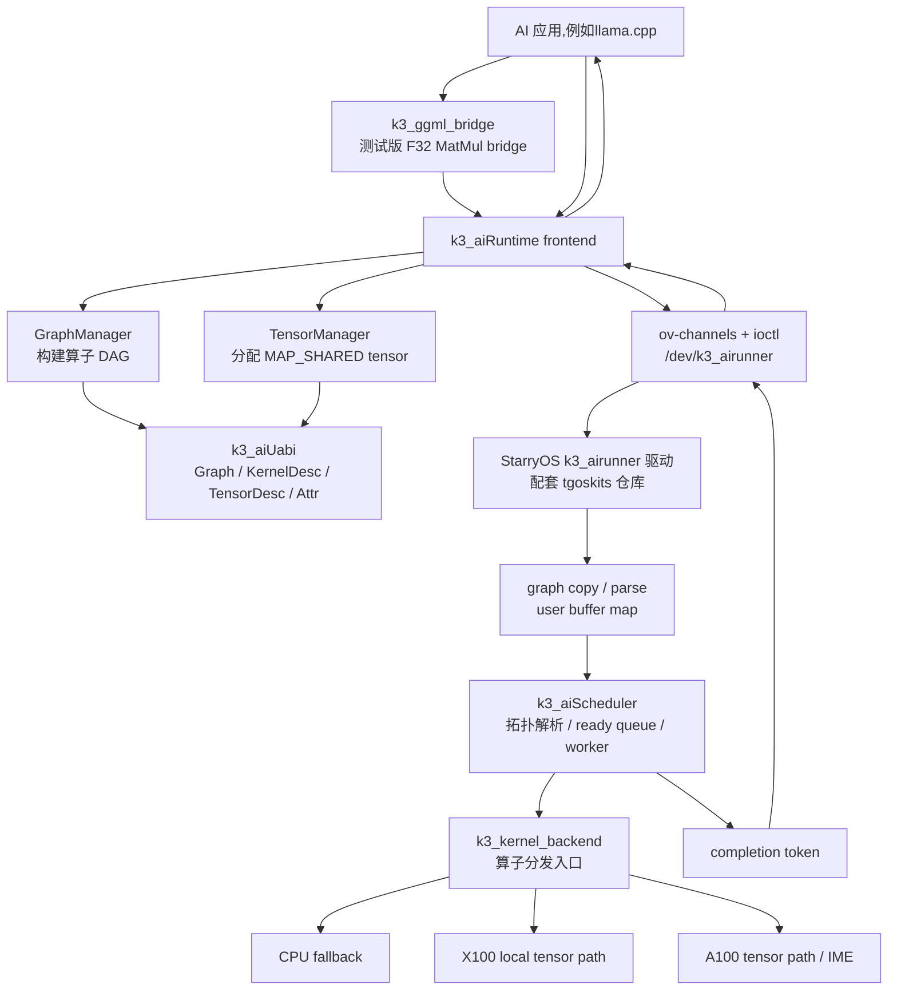

# 系统框架设计

## 设计目标

k3x-HERA-RT 中用户态负责把 AI 框架中的算子转换成稳定 UAPI，内核侧只处理 graph、依赖、队列、buffer 映射和 completion，具体算子执行由 backend 根据目标路径完成。

用户库明确知道算子的语义,到了内核中内核只管执行和调度计算任务(内核不懂算子语义,会根据系统负载来调度)

## 当前总体架构

注意:这里是根据当前初赛阶段的实现程度写的,后期大的变化就是增加复杂的调度路径,整体的执行流程还是这样

## 模块划分

| 模块 | 职责 |
|---|---|
| `k3_aiRuntime` | 用户态 frontend，提供 tensor 分配、graph 构建、channel 建立、graph 提交和 completion 等待接口 |
| `k3_aiUabi` | 内核和用户态共享的稳定 ABI，定义 `AiTensorDesc`、`AiKernelDesc`、`AiGraphSubmitEntry`、graph blob、算子 attr 和错误类型 |
| `k3_aiScheduler` | 内核侧 graph scheduler，解析 DAG，生成稳定拓扑序，维护 ready queue，驱动 worker 执行 node |
| `k3_kernel_backend` | backend 分发入口，根据 `KernelOp` 与 `AiTargetHint` 调用 CPU/X100/A100 对应实现 |
| `k3_ggml_bridge` | 测试版 ggml/llama.cpp bridge，当前将 F32 MatMul 请求转换为 `k3_aiRuntime` graph 提交 |
| `k3_test` | 最小集成测试，构造 DAG 并提交到 `/dev/k3_airunner` |
| `tgoskits` 仓库 | StarryOS K3 板级适配、`k3_airunner` 设备驱动、`/proc/set_ai_thread`、UFS/GMAC/SDMMC 等板级代码 |

## 提交流程

1. AI 应用可以直接调用 `k3_aiRuntime` frontend；测试版 ggml/llama.cpp 接入则先经过 `k3_ggml_bridge`。
2. `TensorManager` 分配稳定的 `MAP_SHARED` tensor buffer，并生成 `AiTensorDesc`。
3. `GraphManager` 把算子和依赖关系组织成 `AiGraphBlob`。
4. 用户态通过 `/dev/k3_airunner` 建立共享 channel，并提交 `AiGraphSubmitEntry`。
5. 内核驱动拷贝 graph blob，校验用户 buffer，并把 tensor 映射为内核可访问地址。
6. `k3_aiScheduler` 将 DAG 解析为稳定拓扑序，送入 worker。
7. worker 调用 `k3_kernel_backend::k3_run_kernel`，由 backend 执行 CPU fallback、X100 或 A100 路径。
8. graph 完成后，内核通过 channel 回写 completion token，用户态按 token 匹配完成状态。

## 当前 调度策略

**当前阶段**：DAG 通过拓扑排序为稳定直链，worker 按 FIFO 执行。后续调度策略会逐步加入：

- 小 tensor、低负载、低提交开销场景优先 直接用户态执行(不进内核) 或 X100 local tensor path。
- 大计算任务、长 DAG、高吞吐任务优先 A100 tensor path。
- A100 拥塞时，**尝试**将具备等价 backend 的任务卸载到 X100 或 CPU fallback。
- X100 本地路径过载时，**尝试**将重任务转移到 A100。
- timeout、error、unsupported op 触发 CPU fallback 或错误 completion。

## 内存与一致性设计

graph blob 在提交后会被内核**拷贝**为私有数据，避免用户态在提交后修改 graph 语义造成 TOCTOU(用户数据在内核安全检查后进行二次修改) 问题。tensor data 不直接复制，当前通过建立内核到物理内存的映射建立数据通路。
