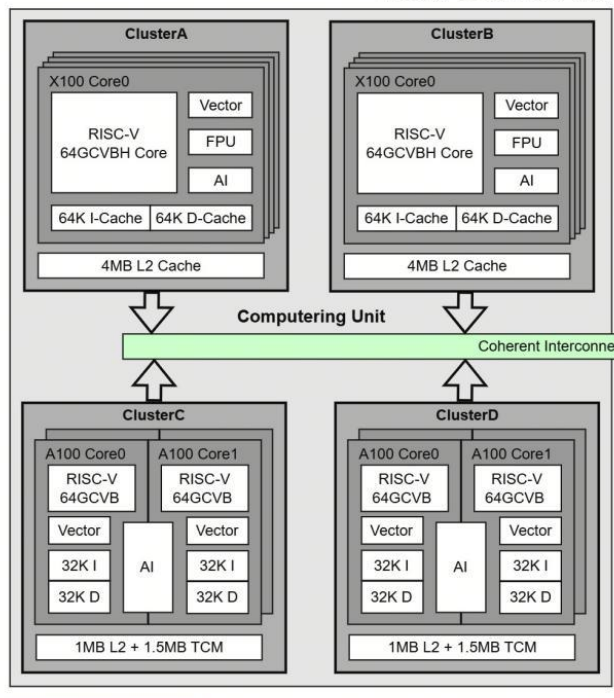
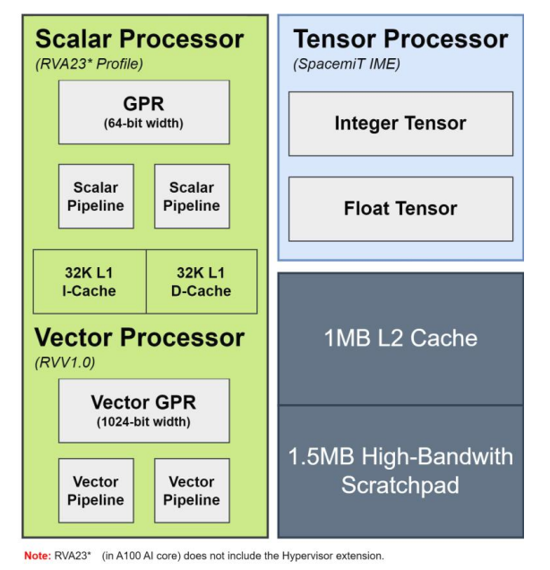

# 第一周周报（6.2-6.8）

# 进行中...

本周主要围绕 K3/K3x 的 datasheet、用户手册、开源资料和官方 AI runtime 包进行资料梳理，目标是确认 K3x 的 AI 算力组织方式，并据此制定后续开发计划。

## 本周工作概览

本周完成了五件事：

- 阅读 K3/K3x 相关硬件资料，整理 X100、A100、Vector、FPU、Tensor/AI 单元、DMA、TCM 等关键模块之间的关系。
- 检索 linux-k3 公开驱动，确认是否存在传统 NPU/A100 command-submission 风格驱动。
- 逆向分析 SpacemiT 官方 ONNX Runtime EP 后端，确认 `libspacemit_ep.so` 中图编译、算子派发、TCM/DMA/MMZ 管理和算子执行的大致位置。
- 确认要编译和使用 A100 专用 IME 指令，需要使用 SpacemiT 官方交叉编译工具链。
- 开始实现用户态算子库 frontend 的最小结构，先把提交到 uring 的 kernel desc、tensor desc 和 data token 这些基础结构定下来。

这些工作共同指向一个结论：K3/K3x 的 AI 算力更适合按“异构计算资源”来组织，而不是按传统外挂 NPU 驱动来组织。

## K3x 的异构 AI 算力结构

根据当前资料，K3x 可按 8 个 X100 核心和 8 个 A100 核心来理解。X100 主要承担通用计算、系统调度、用户态入口和轻量 AI 任务；A100 是更重的 AI 计算核心，面向更大的 tensor/vector 工作负载。

从 cluster 图可以看到，X100 cluster 中的每个 X100 core 除了 RISC-V 64GCVBH Core、Vector、FPU 之外，还并列标出了 AI 模块。这说明 X100 侧并不是完全没有本地 AI 能力。后续文档中，暂时将 X100 侧这种轻量 AI/Tensor 执行路径称为 **X100 local tensor path**。

A100 cluster 则更明确地面向 AI 计算：每组 A100 core 配套 Vector、AI/Tensor Processor、L2 Cache 和 TCM。A100 侧的 tensor 执行路径后续称为 **A100 tensor path** 或 **A100 Tensor Processor**。

A100 架构图中可以看到，A100 core 由 Scalar Processor、Vector Processor 和 Tensor Processor 组成。Tensor Processor 标注为 SpacemiT IME，并进一步分为 Integer Tensor 和 Float Tensor。这与官方 IME 指令集资料中 A100 支持完整矩阵扩展的描述一致。

## X100 local tensor path 与 A100 tensor path

X100 与 A100 都可以参与 AI 计算，但定位不同。

X100 local tensor path 更适合短突发、轻量级、小 tensor 或低提交开销任务。它的价值不在于替代 A100，而是在系统负载较轻或任务规模较小时，避免所有 AI 任务都进入 A100 队列。

A100 tensor path 更适合重型矩阵乘法、LLM 核心算子、大 batch 或长 DAG 场景。A100 的 RVV VLEN 更大，并且公开资料中明确列出了更完整的 IME 子扩展支持。

X100 cluster 图中虽然标出了 AI 模块，但 X100 local tensor path 的精确 ISA 支持范围还需要后续通过工具链、hwcap/cpufeature 和真机非法指令探针确认。当前可以先把 X100 侧视为轻量 AI candidate，把 A100 侧视为完整 AI candidate。

## IME 支持范围整理

公开 IME 资料中明确列出了 A100 支持 13 个 IME 子扩展。A60 作为较早一代 AI 核，只支持 2 个子扩展。X100 local tensor path 的具体支持矩阵仍需后续验证，但可以先参考这种“轻量路径 vs 完整路径”的差异来规划调度策略。

| 路径 | 已知/待确认支持 | 说明 |
|---|---|---|
| A60 / 轻量矩阵路径参考 | `Xsmti8i32mm`、`Xsmti8i32mm_slide` | 公开 IME 文档中已列出的轻量 AI 核支持范围，可作为 X100 local tensor path 的最小参考模型 |
| A100 tensor path | 13 个 IME 子扩展 | 支持整数、滑窗、结构化稀疏、分块量化、FP16/BF16 到 FP32 等完整矩阵路径 |
| X100 local tensor path | 待真机探针确认 | cluster 图显示 X100 core 旁存在 AI 模块，但具体指令支持范围需后续验证 |

A100 支持的子扩展如下：

| 子扩展 | 类型 | 说明 |
|---|---|---|
| `Xsmti4i32mm` | Int4 -> Int32 | 整数矩阵乘法 |
| `Xsmti8i32mm` | Int8 -> Int32 | 整数矩阵乘法 |
| `Xsmti8i32mm_slide` | Int8 -> Int32 | 面向卷积/滑窗的整数矩阵乘法 |
| `Xsmti4i32mm_42sp` | Int4 -> Int32 | 4:2 结构化稀疏整数矩阵乘法 |
| `Xsmti8i32mm_42sp` | Int8 -> Int32 | 4:2 结构化稀疏整数矩阵乘法 |
| `Xsmti4fp16mm_scl16f` | Int4 + scale -> FP16 | 分块量化矩阵乘法 |
| `Xsmti4bf16mm_scl16f` | Int4 + scale -> BF16 | 分块量化矩阵乘法 |
| `Xsmti8fp16mm_scl16f` | Int8 + scale -> FP16 | 分块量化矩阵乘法 |
| `Xsmti8bf16mm_scl16f` | Int8 + scale -> BF16 | 分块量化矩阵乘法 |
| `Xsmtfp16fp32mm` | FP16 -> FP32 | 浮点矩阵乘法 |
| `Xsmtbf16fp32mm` | BF16 -> FP32 | 浮点矩阵乘法 |
| `Xsmtfp16fp32mm_slide` | FP16 -> FP32 | 面向卷积/滑窗的浮点矩阵乘法 |
| `Xsmtbf16fp32mm_slide` | BF16 -> FP32 | 面向卷积/滑窗的浮点矩阵乘法 |

这个差异直接影响后续调度策略：X100 local tensor path 适合作为轻量、低延迟、本地优先的候选路径；A100 tensor path 适合作为重型 AI 任务的主要执行路径；CPU fallback 则用于正确性兜底和不支持算子的兼容执行。
[SpacemiT AI 矩阵扩展指令集（`Zvvm_spacemit` Profile）](https://github.com/spacemit-com/docs-ai/blob/main/zh/architecture/ime_extension.md)

## linux-k3 驱动检索结果

本周在 linux-k3 公开驱动中检索 A100/NPU 风格的传统计算提交驱动，没有发现类似 `/dev/npu`、`/dev/a100` 这种内核接收算子或 command buffer 并提交计算的驱动路径。

目前能对应到 AI 运行链路的更多是资源和通道类接口，例如 DMA、TCM、线程绑定、共享内存或中断相关机制。这说明 K3/K3x 的 A100 更像可运行用户态代码的 AI CPU 域，而不是一个只能通过内核 ioctl 提交任务的外设 NPU。

这一点对项目方向非常关键：如果 A100/X100 的 AI 指令可以在用户态执行，那么我们的运行时不必围绕“内核接收完整算子并代替用户态执行”来设计，而应围绕“用户态 backend 实现 + 内核调度资源和队列”来设计。

## SpacemiT ONNX Runtime EP 逆向发现

随后对 SpacemiT 官方 ONNX Runtime EP 后端进行了逆向分析，重点观察 `libspacemit_ep.so` 和相关运行时库的行为。

初步结论如下：

- ONNX Runtime 负责模型加载、图解析和 EP 分区。
- `libspacemit_ep.so` 负责 SpineGraph 构建、算子支持判断、算子派发和具体 compute kernel 调用。
- TCM 管理通过 `libspine_tcm.so` 动态加载并调用。
- DMA、MMZ、TCM、线程绑定等资源管理逻辑主要在用户态 runtime 中完成。
- 没有发现“内核驱动接收完整算子并统一提交 A100 计算”的传统路径。

这进一步验证了本周的判断：SpacemiT 官方路径本身就是以用户态 AI runtime 为中心的。官方 runtime 在用户态完成图编译、算子选择、内存准备和计算执行；内核供资源节点、映射、同步和线程绑定能力。

[AI CPU的资料目录](https://github.com/spacemit-com/docs-ai/blob/main/zh/index.md)

## 6.7-6.8：工具链确认与用户态算子库 frontend 雏形

6.7-6.8 主要从资料确认转到第一阶段的代码结构设计。

首先确认了编译工具链问题。普通 RISC-V 工具链可以编译常规 RV64 程序，但要写 A100 专用 IME 指令，不能只靠系统默认 gcc/clang。后续需要使用 SpacemiT 官方交叉编译工具链，尤其是其中对 SpacemiT 扩展指令、汇编 mnemonic 和目标架构参数的支持。这样后面写 A100 IME kernel、验证 IME 指令能不能正常汇编、跑最小指令探针时，路径是明确的。

[SpacemiT 交叉编译工具链使用指南](https://www.spacemit.com/community/document/info?lang=zh&nodepath=tools/user_guide/cross_compiler_user_guide.md)